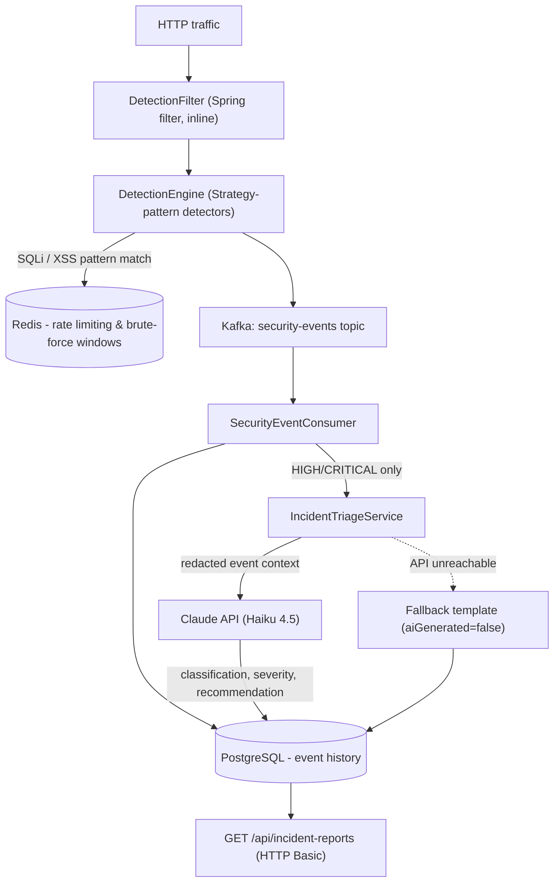

# ThreatLens


**AI-powered threat detection and incident triage platform.** Detects SQL injection, XSS, and
brute-force attacks against a web application in real time, and uses the Claude API to turn
raw security alerts into actionable, OWASP-aligned incident reports.

Built as a portfolio piece targeting two things at once: a **security practitioner**
demonstrating practical attack detection and OWASP-aligned engineering, and a **mature LLM
integration** with a real purpose — SOC alert triage, not a generic chatbot.

> ThreatLens is a defensive security tool. It never generates, launches, or assists real
> attacks — see [Ethical guardrails](#ethical-guardrails) below. It is intended for systems
> you own or are explicitly authorized to monitor.

---

## Run it in 60 seconds

```bash
git clone https://github.com/pabloncf/threat-lens.git
cd threat-lens
docker compose up --build
```

This starts the full stack — Postgres, Redis, Kafka, ThreatLens itself (with its
[intentionally-vulnerable demo endpoints](#the-demo-app) enabled), and an **attack simulator**
that automatically fires a SQL injection, a stored XSS, and a brute-force burst at the demo
endpoints once ThreatLens is healthy. Watch the `attack-simulator` logs, then check the
results:

```bash
curl -u admin:changeme http://localhost:8080/api/incident-reports | jq
```

Each entry is a triaged incident: an OWASP/CWE-aligned classification, a severity, and a
remediation recommendation — generated by Claude for anything scored `HIGH`/`CRITICAL`, with a
graceful fallback template if the Claude API is unreachable or no `ANTHROPIC_API_KEY` is set.

Want AI-generated classifications instead of the fallback template? Set your key first:

```bash
ANTHROPIC_API_KEY=sk-ant-... docker compose up --build
```

---

## Architecture



- **Inline detection, decoupled reporting.** Detection runs synchronously in the request path
  (a Spring `Filter`, one per HTTP request) so nothing about serving traffic depends on Kafka,
  Postgres, or Claude being up. Persistence and AI triage happen downstream, off a Kafka topic,
  entirely decoupled from request latency.
- **Cost-aware LLM integration.** Only events scored `HIGH`/`CRITICAL` (the detectors' own 0–100
  scoring, mapped to severity) reach the Claude API at all — benign and low-signal traffic
  never costs a token. When Claude is unreachable, ThreatLens still returns a triaged report
  (a fallback template, flagged `aiGenerated: false`), never a broken pipeline.
- **Strategy-pattern detectors.** `SqlInjectionDetector`, `XssDetector`, and
  `BruteForceDetector` all implement one `SecurityDetector` interface; adding a new attack
  category (path traversal, SSRF, ...) never touches the engine core.
- **Redaction before the LLM.** Event details are scrubbed of credentials, tokens, and PII
  before they're sent to Claude — only the minimum needed for classification leaves the
  process.

## The demo app

`docker compose up` also runs ThreatLens itself in a `demo` Spring profile, which enables two
endpoints that are **genuinely vulnerable, on purpose** — not just accepting attacker-shaped
traffic, but actually exploitable, against an isolated, throwaway schema seeded with fake data:

| Endpoint | Vulnerability | What the bundled simulator does |
|---|---|---|
| `POST /demo/login` | SQL injection (string-concatenated query) | UNION-based injection that exfiltrates a demo user's password through the response |
| `POST` / `GET /demo/comments` | Stored XSS (unescaped render) | Stores a cookie-theft-shaped `<script>` payload |
| `POST /demo/login` (repeated) | — | 8 rapid failed logins to trigger brute-force detection |

Every one of these is caught and triaged by the same pipeline described above. This is the
**only** place any "attack" exists in this repository — fired only at this bundled, isolated
demo target, by the bundled simulator, never at anything else. See
[Ethical guardrails](#ethical-guardrails).

## Tech stack

| Layer | Choice |
|---|---|
| Language | Java 21 |
| Framework | Spring Boot 4.1, Spring Security, Spring Web |
| Event bus | Apache Kafka (KRaft) |
| Cache / limiter | Redis (sliding-window rate limiting, brute-force windowing) |
| Persistence | PostgreSQL + Flyway |
| AI | Anthropic Claude API (Haiku 4.5, structured JSON output) |
| Build | Maven |
| Container | Docker + Docker Compose |
| CI/CD | GitHub Actions (tests + OWASP Dependency-Check) |
| Testing | JUnit 5, Mockito, Testcontainers, Spring Boot Test |

## API

All endpoints require HTTP Basic auth except `/actuator/health` and `/demo/**` (the public
demo attack surface — a real login/comment form has no auth of its own either). Default demo
credentials: `admin` / `changeme` — override via `API_ADMIN_USERNAME`/`API_ADMIN_PASSWORD`.

| Method | Path | Description |
|---|---|---|
| `GET` | `/api/incident-reports` | Paginated list, sorted by `createdAt` desc by default |
| `GET` | `/api/incident-reports/{id}` | Single report, 404 if missing |

## Ethical guardrails

- **No offensive capability.** ThreatLens never generates, launches, or assists real attacks.
  The only "attacks" anywhere in this repo are the synthetic traffic described above, fired by
  the bundled simulator against the bundled, isolated demo endpoints — self-contained, never
  pointed at a third-party target.
- **Authorization framing.** ThreatLens is for systems you own or are explicitly authorized to
  monitor.
- **Responsible incident reporting.** AI-generated reports describe what was detected and how
  to remediate it — never exploit code or step-by-step attack instructions. Remediation
  references OWASP/CWE.
- **No sensitive data in prompts.** Credentials, tokens, and PII are redacted from event
  context before it reaches the LLM; only the minimum needed for classification is sent.

## Project structure

Package-by-feature, not by layer:

```
src/main/java/com/pabloncf/threatlens/
├── common/      # Severity enum shared across features
├── detection/   # DetectionEngine, SecurityDetector strategy, SQLi/XSS/brute-force detectors
├── pipeline/    # DetectionFilter, Kafka producer/consumer, SecurityEventMessage
├── triage/      # ClaudeTriageClient, redaction, severity gate, fallback
├── report/      # IncidentReport entity/repository, REST API
├── demo/        # Intentionally-vulnerable demo endpoints (demo profile only)
└── config/      # Spring Security configuration
```

## Building this project

ThreatLens was built end-to-end with [Claude Code](https://claude.com/claude-code), across 8
phases with a confirmation gate at each step: foundation → event model → detection engine →
rate limiting → event pipeline → AI triage → incident API → this demo/CI/polish phase. Every
commit is a Conventional Commit; the full history reads as the engineering progression.
